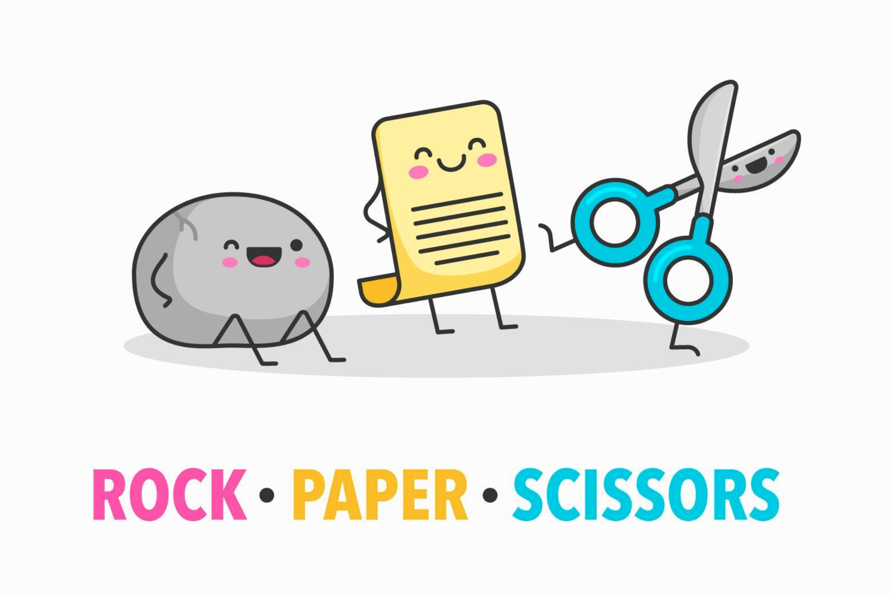

# Rock - Paper - Scissors !



## Description of Game
### Rock paper scissors is a hand game played between two people. Each player simultaneously forms one of three shapes with an outstretched hand. These shapes are "rock" (a closed fist), "paper" (a flat hand), and "scissors" (a fist with the index finger and middle finger extended, forming a V).

## How to play
### Three Simple Rules:
1. Rock **beats** Scissors
1. Paper **beats** Rock
1. Scissors **beats** Paper

*If both players select the same choice then a **draw** occurs.*

*The player with the most points out of 5 rounds will win!*


## Pseudocode

``` javascript
/*
make a function start() to start the game
    insert alert for user here
    sets score to 0
    resetScore();
    userChoice();

Create userChoice() function
    question user if they are going to select Rock, Paper, or scissors
        switch statement

Create a callback function to compare userChoice() & computerChoice()
    if else statements
        if its a 
        how to pick a winner
    
keeps score of game function - updateScore()

reset score to 0 function - resetScore()

How would I create a function to make 5 rounds? stuck on this part. A

Need to come up with a function for if the player won, loses, or it's a tie!
    if else statement

use start() at the end of the game to restart the game
    start();
*/
```


 
 